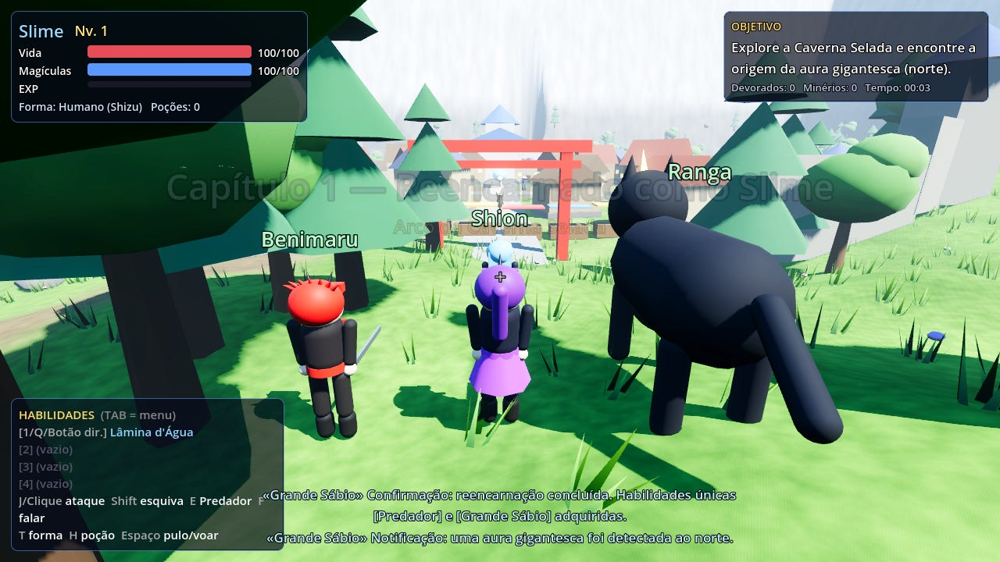
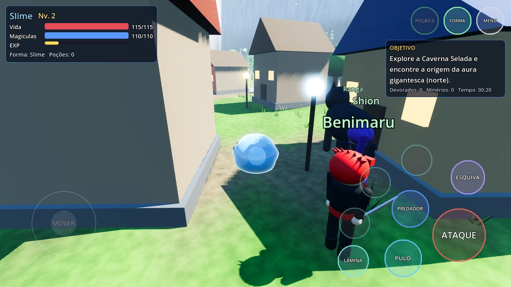
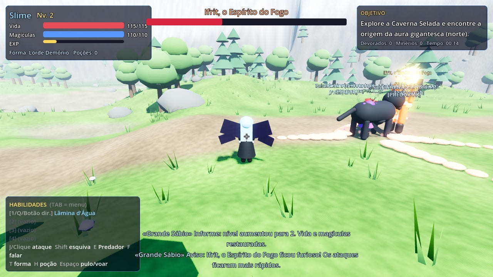
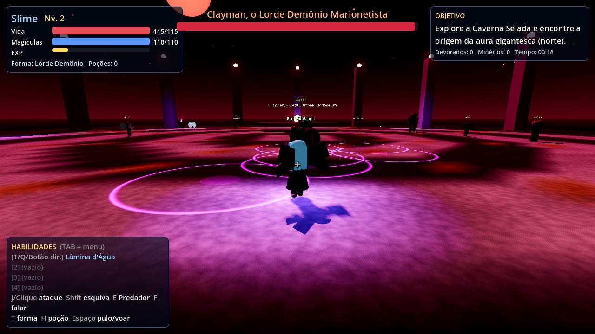

# Mod-Minecraft-

## Tensura: Reencarnado como Slime 3D (Godot 4)

O jogo está na pasta [`tensura-slime-3d/`](tensura-slime-3d/README.md): importe o
`tensura-slime-3d/project.godot` no Godot 4.3+ e aperte F5. Funciona no PC e no celular
(controles de toque).

| | |
|---|---|
|  |  |
|  |  |

Screenshots feitas no renderizador Compatibility (o mesmo dos celulares mais simples).
